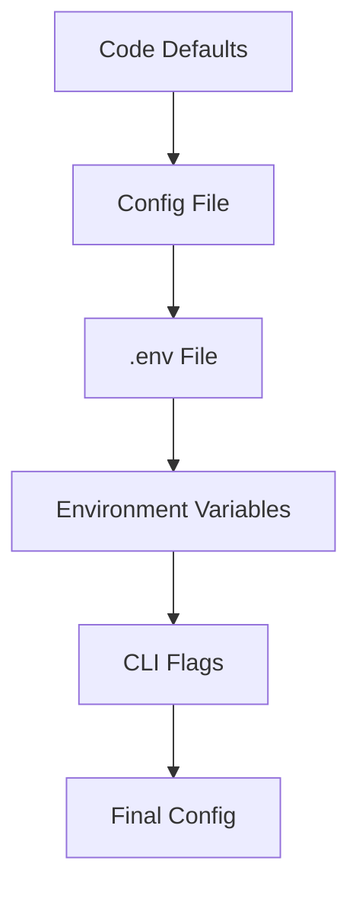

# Configuration Documentation

Template for standalone configuration reference documentation.

## Required Sections

### Environment Variables

A complete table of every environment variable with name, required/optional
status, default value, and description.

```markdown
## Environment Variables

### Required

| Variable | Description | Example |
|-|-|-|
| `DATABASE_URL` | Primary database connection string | `postgresql://localhost/myapp` |

### Optional

| Variable | Description | Default |
|-|-|-|
| `LOG_LEVEL` | Logging verbosity | `info` |
| `PORT` | Server listen port | `3000` |
```

### Config File Format

If the project uses config files beyond environment variables, document the
format and location.

```markdown
## Configuration Files

### `config/default.yaml`

\`\`\`yaml
# Annotated example with all keys explained
server:
  port: 3000        # Server listen port
  host: "0.0.0.0"   # Bind address
database:
  pool_size: 10      # Connection pool size
\`\`\`
```

### Required vs Optional Settings

Which settings cause startup failure if absent, and which have defaults.

```markdown
## Required Settings

The application will fail to start if these are missing:

| Setting | Validation Error |
|-|-|
| `DATABASE_URL` | "DATABASE_URL is required" |
| `SECRET_KEY` | "SECRET_KEY must be at least 32 characters" |
```

### Per-Environment Overrides

How to configure different values for development, staging, and production.

```markdown
## Environment-Specific Configuration

[Describe the mechanism: .env files, environment-specific config files,
platform secret managers, etc.]

| Environment | Config Source |
|-|-|
| Development | `.env` or `.env.development` |
| Test | `.env.test` |
| Production | Platform secret manager |
```

Include a Mermaid diagram if the configuration resolution has multiple layers:



## Content Discovery

- **Environment variables**: Read `.env.example` or `.env.sample` for the
  canonical list; grep for `process.env.`, `os.environ`, `os.Getenv`,
  `std::env::var`, `env::var` in source files to find all references
- **Config files**: Check for `config/`, `config.json`, `config.yaml`,
  `*.config.js`, `*.config.ts`, `app.config.*`, `settings.py`,
  `application.properties`
- **Required vs optional**: Grep for early validation patterns —
  `if (!process.env.X) throw`, `required: true`, Zod `.min(1)`, `unwrap()` on
  env reads; also check for `|| 'default'` or `.unwrap_or()` patterns that
  indicate optional
- **Defaults**: Grep for `process.env.X || 'value'`, `getenv().unwrap_or()`,
  `os.environ.get(X, default)`, config schema `.default()` calls
- **Per-environment files**: Check for `.env.development`, `.env.production`,
  `.env.test`, `config/development.*`, `config/production.*`, `NODE_ENV`
  conditionals
- **Config validation**: Look for config schema definitions (Zod, Joi, Yup,
  pydantic, viper) near the config loading entry point
