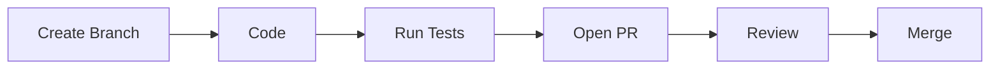

# Developer Guide Documentation

Templates for developer onboarding, contributing guides, and coding conventions.

## Developer Guide Structure

```markdown
# Developer Guide

## Quick Start

[Minimal steps to get a development environment running — clone, install, run.
Keep this under 10 lines. Link to detailed setup below.]

## Development Environment

### Prerequisites

[Exact tools and versions required]

### Setup

[Step-by-step with every command copy-pasteable]

### Verification

\`\`\`bash

# After setup, verify everything works:

make test # All tests pass make dev # Dev server starts on http://localhost:3000
\`\`\`

## Project Structure

\`\`\` [Annotated directory tree — only top 2 levels, with descriptions] \`\`\`

## Development Workflow

### Making Changes

1. Create a feature branch: `git checkout -b feat/my-feature`
2. Make changes following the coding conventions below
3. Write tests for new functionality
4. Run the full test suite: `make test`
5. Submit a pull request

### Running Tests

\`\`\`bash make test # Full suite make test-unit # Unit tests only make
test-integration # Integration tests (requires running services) make
test-coverage # Generate coverage report \`\`\`

### Building

\`\`\`bash make build # Production build make build-dev # Development build with
debug symbols \`\`\`

## Coding Conventions

### File Organization

[Where new files should go, naming conventions]

### Naming

[Variable, function, type naming conventions specific to this project]

### Error Handling

[How this project handles errors — patterns, conventions, custom types]

### Testing

[Test file placement, naming, framework patterns, what to test]

## Common Tasks

### Adding a New API Endpoint

1. [Step-by-step specific to this project's patterns]

### Adding a Database Migration

1. [Step-by-step with actual commands]

### Adding a New Dependency

1. [How to add, vet, and document new dependencies]
```

## Contributing Guide (CONTRIBUTING.md)

For open-source or team projects:

```markdown
# Contributing

## How to Contribute

1. Fork the repository
2. Create a feature branch from `main`
3. Make your changes
4. Write or update tests
5. Ensure all checks pass
6. Submit a pull request

## Pull Request Guidelines

- Keep PRs focused on a single change
- Include tests for new functionality
- Update documentation if behavior changes
- Follow the commit message format below

## Commit Messages

[Project's actual commit convention — conventional commits, gitmoji, etc.]

Format: `type(scope): description`

Types: `feat`, `fix`, `docs`, `refactor`, `test`, `chore`

Examples:

- `feat(auth): add OAuth2 login flow`
- `fix(api): handle null response from upstream`

## Code Review

- All PRs require at least one approval
- Address review comments or explain why you disagree
- Squash commits before merging (if that's the project convention)

## Development Setup

See [Developer Guide](docs/developer-guide.md) for environment setup.

## Reporting Issues

Use GitHub Issues with the appropriate template:

- **Bug Report**: Include steps to reproduce, expected vs actual behavior
- **Feature Request**: Describe the use case, not just the solution
```

## Coding Conventions Document

For projects that need a standalone conventions doc:

```markdown
# Coding Conventions

## Language-Specific

### [Language] Style

- [Formatter and config: e.g., "Run `prettier` with project config"]
- [Linter and config: e.g., "ESLint with `@company/eslint-config`"]
- [Key style rules specific to this project]

## Patterns

### [Pattern Name] (e.g., "Repository Pattern")

[Brief description of when and how to use this pattern in this codebase, with a
concrete example from an existing file]

### [Anti-Pattern Name]

[What NOT to do, with explanation of why]

## Dependencies

- Prefer stdlib over third-party when functionality is comparable
- New dependencies require team discussion for packages over 100KB
- Pin exact versions in lock files

## Documentation

- Public functions require doc comments
- Non-obvious logic requires inline comments explaining why, not what
- Update relevant docs when changing behavior
```

## Diagrams

Developer guides describe workflows and architecture — include Mermaid diagrams
for:

- **Development workflow** — branch → code → test → PR → merge flow:



- **Project structure** — component relationships, module dependencies
- **Request lifecycle** — how a request flows through the application layers
- **Common task flows** — e.g., "adding a new endpoint" as a step-by-step
  flowchart when the process spans multiple files/components

## Tips

- Extract conventions from actual code, don't impose external standards
- Reference existing files as examples: "See `src/services/user.ts` for the
  pattern"
- Include the actual linter/formatter commands the project uses
- Keep "Common Tasks" section practical — real steps developers need regularly
- Test the Quick Start section on a clean checkout
- Include Mermaid diagrams for development workflows and architecture
