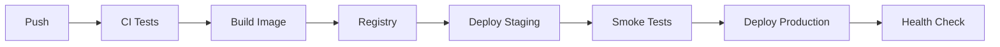

# Operations Documentation

Templates for deployment guides, runbooks, and migration guides.

## Deployment Guide

Structure for documenting how to deploy the project:

```markdown
# Deployment Guide

## Overview

[Brief description of the deployment architecture: where the app runs, what
infrastructure it depends on, and the deployment strategy (blue-green, rolling,
canary, etc.)]

## Prerequisites

- [Infrastructure access: cloud accounts, credentials, VPN]
- [Tools: CLI tools, container runtimes, IaC tools with versions]
- [Secrets: what secrets are needed, where to obtain them (NOT the values)]

## Environments

| Environment | Purpose                   | URL                         | Deploy Trigger    |
| ----------- | ------------------------- | --------------------------- | ----------------- |
| Development | Local testing             | http://localhost:3000       | Manual            |
| Staging     | Pre-production validation | https://staging.example.com | Push to `staging` |
| Production  | Live traffic              | https://example.com         | Merge to `main`   |

## Deployment Process

### Automated (CI/CD)

[Step-by-step of what the CI/CD pipeline does]

1. Tests run on PR
2. Merge to main triggers build
3. Docker image built and pushed to registry
4. Deployment tool (ArgoCD / Flux / ECS / etc.) picks up new image
5. Health checks pass → traffic shifts

### Manual Deployment

\`\`\`bash

# Build

[actual build command]

# Deploy

[actual deploy command]

# Verify

[actual verification command — health check URL, smoke test] \`\`\`

## Configuration

### Environment Variables

| Variable       | Required | Description                              | Example          |
| -------------- | -------- | ---------------------------------------- | ---------------- |
| `DATABASE_URL` | yes      | Primary database connection              | `postgres://...` |
| `REDIS_URL`    | no       | Cache connection (defaults to in-memory) | `redis://...`    |

### Secrets Management

[How secrets are stored and injected: Vault, AWS Secrets Manager, env files,
Kubernetes secrets, etc.]

## Monitoring

- **Health endpoint**: `GET /healthz` — returns 200 when healthy
- **Metrics**: [Prometheus endpoint, DataDog agent, etc.]
- **Logs**: [Where to find logs: CloudWatch, Loki, etc.]
- **Alerts**: [What alerts exist and where they notify]

## Rollback

\`\`\`bash

# Roll back to previous version

[actual rollback command]

# Verify rollback succeeded

[actual verification command] \`\`\`
```

### Deployment Doc Checklist

For each environment, document:

- How to deploy (automated and manual)
- How to verify deployment succeeded
- How to roll back
- Where to find logs and metrics
- What secrets/config are needed

## Runbook

Structure for operational procedures:

```markdown
# Runbook

## Service Overview

- **Service**: [name]
- **Owners**: [team/individuals]
- **Dependencies**: [upstream and downstream services]
- **SLO**: [availability target, latency target]

## Common Procedures

### Restart the Service

**When**: Service is unresponsive, health checks failing after investigation.

\`\`\`bash [actual restart command] \`\`\`

**Verify**: `curl -s https://example.com/healthz` returns 200 within 60s.

### Scale Up/Down

**When**: High load alerts, cost optimization.

\`\`\`bash

# Scale to N replicas

[actual scale command]

# Verify

[verification command] \`\`\`

## Incident Procedures

### Database Connection Exhaustion

**Symptoms**: 5xx errors, "too many connections" in logs.

**Diagnosis**: \`\`\`bash

# Check connection count

[actual query or command] \`\`\`

**Resolution**:

1. [Step 1 with actual command]
2. [Step 2 with actual command]

**Prevention**: [What to configure to prevent recurrence]

### High Memory Usage

**Symptoms**: OOM kills, degraded performance.

**Diagnosis**: \`\`\`bash [actual command to check memory] \`\`\`

**Resolution**:

1. [Step 1]
2. [Step 2]

### [Service-Specific Incident Type]

[Same format: symptoms, diagnosis, resolution, prevention]

## Maintenance Tasks

### Database Maintenance

\`\`\`bash

# Run migrations

[actual command]

# Vacuum/optimize

[actual command]

# Backup

[actual command] \`\`\`

### Certificate Renewal

[Steps if not automated, or documentation of the automation]

### Log Rotation

[Configuration or manual steps]
```

### Runbook Entry Checklist

For each procedure:

- When to perform it (trigger condition)
- Exact commands (copy-pasteable)
- How to verify it worked
- What can go wrong and how to recover
- Prevention measures

## Migration Guide

Structure for documenting breaking changes and upgrades:

```markdown
# Migration Guide: v1.x → v2.0

## Breaking Changes Summary

| Change                | Impact            | Action Required      |
| --------------------- | ----------------- | -------------------- |
| API endpoint renamed  | All API consumers | Update endpoint URLs |
| Config format changed | All deployments   | Migrate config files |
| Node.js 18 → 20       | Build pipeline    | Update runtime       |

## Before You Start

- [ ] Back up your database
- [ ] Read the full changelog for v2.0
- [ ] Ensure you're on the latest v1.x release
- [ ] Allocate [estimated time] for the migration

## Step-by-Step Migration

### 1. Update Dependencies

\`\`\`bash [actual commands] \`\`\`

### 2. Migrate Configuration

**Before** (v1.x format): \`\`\`yaml [actual old format] \`\`\`

**After** (v2.0 format): \`\`\`yaml [actual new format] \`\`\`

### 3. Run Database Migrations

\`\`\`bash [actual migration commands] \`\`\`

### 4. Update API Calls

| v1.x              | v2.0                      | Notes                    |
| ----------------- | ------------------------- | ------------------------ |
| `GET /api/users`  | `GET /api/v2/users`       | Response shape unchanged |
| `POST /api/login` | `POST /api/v2/auth/login` | New field: `mfa_token`   |

### 5. Verify

\`\`\`bash

# Run test suite

[actual test command]

# Smoke test

[actual verification commands] \`\`\`

## Rollback Plan

If migration fails:

1. [Step-by-step rollback with actual commands]
2. [How to restore database backup]
3. [How to revert config changes]

## Known Issues

- [Issue description and workaround]
```

## Content Discovery

- **Deployment targets**: Check for `Dockerfile`, `docker-compose.yml`,
  `vercel.json`, `netlify.toml`, `fly.toml`, `railway.json`, `serverless.yml`,
  `render.yaml`, `flake.nix`, `k8s/`, `terraform/`, `pulumi/`
- **CI/CD pipeline**: Read `.github/workflows/*.yml`, `.gitlab-ci.yml`,
  `Jenkinsfile`, `bitbucket-pipelines.yml` for deploy steps; extract triggers,
  build commands, deploy commands
- **Environment config**: Cross-reference `.env.example` required variables with
  deployment context; check for platform-specific env config
- **Monitoring**: Check dependencies for `@sentry/*`, `dd-trace`, `newrelic`,
  `@opentelemetry/*`, `prom-client`; check for `sentry.config.*`,
  `datadog.config.*` files
- **Health endpoints**: Grep for `/health`, `/healthz`, `/ready`, `/readiness`,
  `/liveness` in route files
- **Rollback**: Check CI workflows for rollback steps; check deployment configs
  for rollback commands

## Diagrams

Operations docs describe multi-step processes — these MUST include Mermaid
diagrams. Add diagrams for:

- **Deployment pipeline** — the CI/CD flow from commit to production:



- **Environment promotion** — how changes flow across environments
- **Incident response flow** — escalation paths, decision points
- **Rollback procedure** — decision tree for when/how to roll back
- **Service dependency graph** — what depends on what, failure blast radius

## Tips

- Extract deployment steps from actual CI/CD configs and Dockerfiles
- Runbook procedures should be tested — run each command to verify it works
- Migration guides should include before/after examples for every breaking
  change
- Always include rollback procedures — they're needed when things go wrong
- Use consistent formatting: Symptoms → Diagnosis → Resolution → Prevention
- Include Mermaid diagrams for every multi-step operational process
